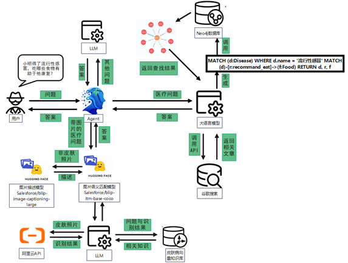
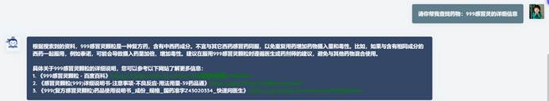
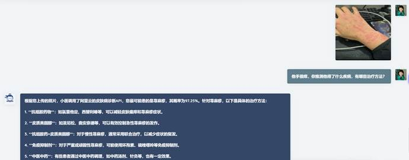
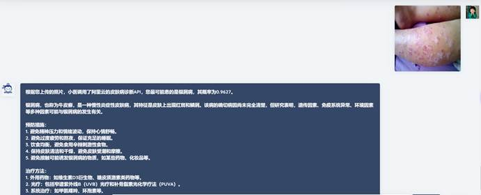
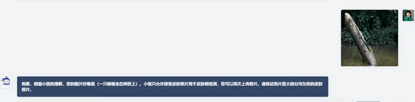
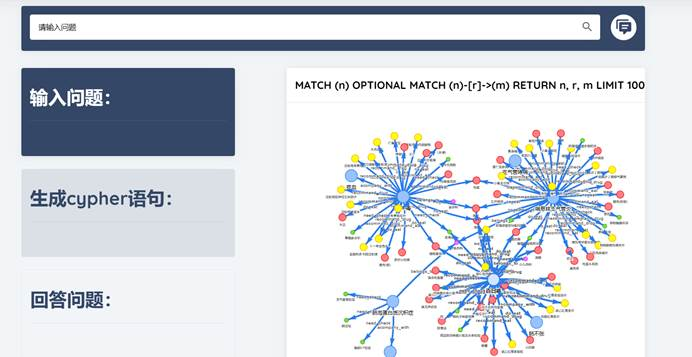
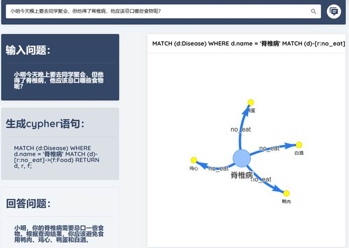

# 书生医疗

## 介绍

我们使用书生浦语大语言模型技术和众多工具搭建一个医疗问答平台。旨在整合医疗资源，提供快速、准确、全面的医疗咨询服务，帮助患者更轻松地获取医疗信息，更好地理解和管理自己的健康问题，利用人工智能技术赋能医疗行业。

作为书生浦语训练营的结项项目，这个系统是一个基于 InternLM2 大语言模型的智能对话系统，综合运用了所学的 RAG检索增强技术、微调、智能体 Agent、Hugging Face 模型api等多种技术。系统设计旨在为用户提供高效、准确的对话交互和信息检索服务。具体提供的服务包括：

- 医疗问题问答，知识来源包括Neo4j数据库和Tavily在线资源搜索
- 皮肤病检测与问答，支持上传**图片**和**文本**格式
- 医疗知识可视化：当用户提出问题时，会在Neo4j数据库中查找相关节点关系，并将其在前端进行可视化展示

相关环境需求请参考本项目require文件夹

注：本项目基于上海人工智能实验室书生浦语训练营，相关知识请参考： [书生·浦语大模型实战营课程](https://github.com/InternLM/tutorial.git)

## 🖥️模型开发

基座模型使用 **internlm2**，系统的功能分为以下四个部分，涵盖了对皮肤病识别、医疗问题问答、一般问答以及医疗知识可视化的处理：

- 皮肤病识别与问答：

  当用户提出带有图片的问题时，系统首先调用 Hugging Face 提供的**blip-itm-base-coco**图像句意匹配 API，以判断图片是否与皮肤病相关。

  若图片与皮肤病相关，则系统调用阿里云的**DetectSkinDisease**皮肤病识别 API 对图片进行诊断，并返回诊断结果。诊断结果与用户问题一起传递给 LLM，在这个过程中，系统会利用皮肤病向量数据库进行 RAG操作，以获取更丰富的信息支持。

  若图片与皮肤病无关，则系统调用 Hugging Face 提供的**blip-image-captioning-large**图像描述模型对图片进行描述，并将描述结果作为回答返回给用户。

- 医疗问题问答：

  系统利用 **CypherQA 链**，根据用户提出的医疗问题自动生成 Neo4j 知识库的 Cypher 查询语句。

  通过执行 Cypher 查询语句，系统从知识库中检索与用户问题相关的医疗知识。LLM 根据 RAG 检索得到的知识进行回答。

如果在知识库中未查询到相关内容，则系统调用 **Tavily** 进行在线资源搜索，以获取更多相关信息。

- 非医疗相关的一般问答：

  对于非医疗相关的问题，系统直接由 LLM 进行回答，无需额外的知识检索。

- 医疗知识可视化：

  当用户提出问题时，系统会根据查询结果从 **Neo4j **数据库中查找相关节点关系，并将其在前端进行可视化展示。

  这种可视化展示有助于用户更直观地理解医疗知识的结构和关联，提升用户体验和对医疗知识的理解。

## ⚡效果展示

- 不带图片的医疗问题：

  LLM会利用 Neo4j 数据库做 RAG，根据用户问题和查询结果返回回答，并给出数据来源。

当医疗问题不存在数据库中时，系统会调用 Tavily 接口从网站上查找相关信息，并返回最相关的文章。

- 带皮肤图片的问题：

  当上传图片时，系统首先判断图片与皮肤病的相似度。如果判断为皮肤病，系统会调用阿里云的皮肤病诊断 API 接口，将问题与诊断结果返回给 LLM 生成回答。在这个过程中，系统会利用皮肤病向量知识库进行 RAG 操作。

  当只上传皮肤照片时，LLM 会根据疾病预防措施和治疗方法生成回答。

  当判断图片并非皮肤病时，系统会调用 Hugging Face 模型，对图片进行描述。

- 医疗知识可视化：

  当没有问题时，系统会展示所有节点与节点之间的关系。

  当问具体问题时，系统会展示疾病所对应节点和其他节点的关系。

通过以上测试数据分析，可以评估系统在不同情况下的表现，确保系统能够有效地回答用户提出的各种问题，并提供准确、全面的信息支持。

## 💕 贡献

### 成员分工

王善路

- 构建Neo4j医疗知识库
- 构建Agent问答体系
- 搭建前端
- 构建基于Neo4j医疗知识库的问答系统
- PPT制作
- 演示视频制作
- 文档撰写

徐一诺

- 调用阿里云皮肤病识别API实现皮肤病诊断
- 构建皮肤病向量知识库
- 完成前后端交互
- 完成基于向量知识库的皮肤病问答系统
- 文档撰写

万顺

- 调用Tavily工具实现大模型与网络资料的交互
- 搜索皮肤病相关知识
- 构建皮肤病向量知识库
- 文档撰写

曾佳贝

- 调用Hugging Face模型赋予大模型图片理解的能力
- 搜索皮肤病相关知识
- 构建皮肤病向量知识库
- 文档撰写

**特别感谢上海人工智能实验室书生浦语训练营和张老师**
